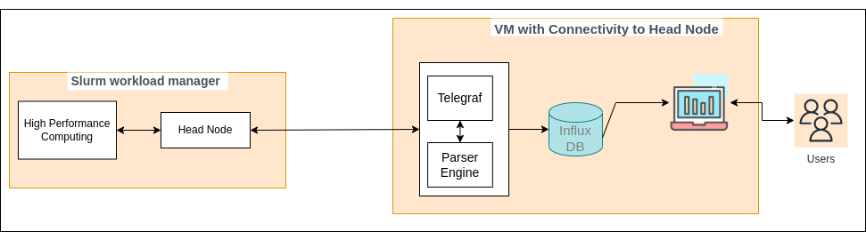

## Monitoring SLURM with TIG stack.
[](https://www.python.org/)
[](https://lbesson.mit-license.org/)

## TIG Stack:  
TIG means telegraf, influx database, grafana. Each components act together in performing data collection from the HPC cluster, pushing the collected data by cleaning, check data quality and pushing it to influx database. For the visualization of the collected data in near-realtime grafana is utilized.

Telegraf: As per the official documentation, telegraf is a server-based agent for collecting and sending all metrics and events from databases, systems, and IoT sensors. The telegraf written in go and offers numerous plugins. One of such plugins utilized in this project is the input.exec plugin to write the data out to influx db through a telegraf line protocol. More info of the ways the data can be sent can be looked up here: https://docs.influxdata.com/telegraf/v1.21/data_formats/input/influx/

Influx Database: It is a time-series based database built to collect data coming in from various format and allows scaling the database on the increasing sizes of the data. It acts well with the telegraf.

Grafana: Dashboarding platform which is open source and pretty can do anything from querying, visualizing, alerting based on the data stored anywhere. The dashboard itself is flexible and can be shared. The advantage of using grafana is the fact the data becomes accessible to anyone within an organization. Thus allowing to build data-driven apps and methodologies.

## Our Architecture:  


## Setting up:  
1. Clone our repository into your environment:  
```
cd /home/<user>
git clone https://github.com/bethgelab/slurm-monitoring.git
```
2. Initialization of the environments:  
- At source: Within the project repository `slurm-monitoring` contains an .env.template. Use this, to setup the required environmental variables. Create a new file called .env `touch .env` and fill up the values in accordance with `.env.template`.
```
#!/bin/bash
eval $(ssh-agent)
# Example: ~/.ssh/id_for_headnode
export KEY=/your/absolute/location/id
# Example: ~/.ssh/secrets/.myscrt -> points to the secret of the key
export SECRET_LOCATION=/your/absolute/location/.mysecret
cat $SECRET_LOCATION | SSH_ASKPASS=/bin/cat setsid -w ssh-add $KEY
```  
If the private key contains a secret even that must be specfied. Note: This is not tested again key not having a secret. As above, set all the required items.

- At scripts: Within the scripts folder, there is another `.env.template`, use that to setup the environments required for the parsing scripts. Create a new file within the scripts folder called `.env` and fill the values based on `.env.template` file.
```
#!/bin/bash
export USER=ironman
export ACCOUNT=marvel
export PATHS="/your/qb/location/$ACCOUNT|/your/qb/$ACCOUNT"
export QBPATHS="/your/qb/work|/your/qb/home|/your/qb"
export HEAD=<HEAD_IP or hostname>
```
As above, specify the username for the head-node, which account the user belongs and has permission, PATHS, QBPATHS where it is located, and the HEAD_IP.

- At influx: Within the influx directory, there is a .env fill. It is required to fill important information within it.
```
# InfluxDB options
# Can be setup/upgrade
DOCKER_INFLUXDB_INIT_MODE=setup
DOCKER_INFLUXDB_INIT_USERNAME=influx
DOCKER_INFLUXDB_INIT_PASSWORD=influx
DOCKER_INFLUXDB_INIT_ORG=organization
DOCKER_INFLUXDB_INIT_BUCKET=bucketname
# DOCKER_INFLUXDB_INIT_RETENTION
# 32 alphanumeric character token. if not specific will be auto-generated.
DOCKER_INFLUXDB_INIT_ADMIN_TOKEN=admintoken
```
The mode should be setup, username, password should be setup individually, influx requires mandatory organization, bucket is the place where all the measurements will be written to and admin token is either auto-generated if not specified or a 32 character token can be generated.

- At grafana: There is .env within the grafana folder use that to setup the username and password for the application.
```
# Grafana options
GF_SECURITY_ADMIN_USER=grafana
GF_SECURITY_ADMIN_PASSWORD=grafana
GF_INSTALL_PLUGINS=
```
3. Starting influx, and grafana docker containers:  
```
make up-influx # Will start the docker container for influx using the above envs
make up-grafana # Will start the docker container for grafana using the above envs
```
This will start the influx and grafana applications. Please look into the `docker-compose.yml` for the ports being exposed for each of these services.

To verify if they are working, open the below urls:  
```
http://<VMIP>:8085/ -> This will open the influx database. Use username and 
password as per the environment configurations at influx/.env.
http://<VMIP>:3001 -> This will open the grafana interface. Use the username and password configured in the grafana/.env file to open up the grafana for usage.
```
4. There is one very important step to do which is to connect grafana data source with influx. Open grafana as described above, move to data sources, create a new data source, choose influx. Note that, the setup requires you pass all the configured information in the influx/.env in the application. For issues with not being able to connect, it should be due to the Authorization. If that occurs pass a custom HEADER as AUTHORIZATION and value token <token_val>. If still error occurs, please look up within the telegraf discussion forum or github issues for flux connectivity.

5. Once the step-3 and step-4 is successfull, let us setup telegraf in the VM itself:  
  a. Installation of telegraf should done first. Use this documentation and perform the required operations https://docs.influxdata.com/telegraf/v1.21/introduction/installation/  
  b. Once, (a) is done, telegraf can be functional to perform collection of various metrics.  
  c. Install make with `sudo apt install make`  
  d. Once, the repository is cloned, initial environment are set as per step(2), step(3), and step(4) are completed go to `telegraf/telegraf.conf` and change the influx configured information as shown below to your details comments details the information to be filled. Fill all the information and save telegraf.conf file:  
  ```
  [[outputs.influxdb_v2]]
   # The URLs of the InfluxDB cluster nodes.
   #
   # Multiple URLs can be specified for a single cluster, only ONE of the
   # urls will be written to each interval.
   # urls exp: http://127.0.0.1:8086
   # Place the IP-Address:PORT
   urls = ["http://127.0.0.1:8086"]

   # Token for authentication. (Created influx or generated token)
   token = ""
  
   # Organization is the name of the organization you wish to write to; must exist.
   organization = ""
  
   # Destination bucket to write into.
   bucket = ""

   insecure_skip_verify = true
  ```
  e. Once a-d is all good, you can start the telegraf to collect metrics as `make start-collection`. To understand the command lookup `start-collecting.sh` file.  
6. To check the output of this, tail -f nohup.out  
7. Login to grafana and import the already stored dashboard.json file in the `grafana/slurm_dashboard.json`.  
8. Now, you should be seeing the collected metrics.  

## Adding, new parsers
To add new parsers and any logic to collect information of the slurm, you can add it in the `scripts/slurm` folder and point the execution in the `main.sh`. Sometimes it could happen that it would not be possible to collect many metrics simultaneously, there add a new input.exec plugin in the telegraf/telegraf.conf pointing to a new `file.sh` thus allowing the collection of the parsed data. Note, that every parser has to finally send out the data in the line protocol format (https://docs.influxdata.com/telegraf/v1.21/data_formats/input/influx/) only.  

```
# Exec plugin example:
[[inputs.exec]]
  ## Commands array
   commands = [
     "scripts/main2.sh"
   ]
   timeout = "10s"
   interval = "30s"
   data_format = "influx"
```

## Maintainers: [Tübingen AI Center](https://tuebingen.ai/)

## Acknowledgements:  
1. https://github.com/slaclab/slurm-telegraf.git
2. Nicolas Chan. 2019. A Resource Utilization Analytics Platform Using Grafana and Telegraf for the Savio Supercluster. In Proceedings of the Practice and Experience in Advanced Research Computing on Rise of the Machines (learning) (PEARC '19). Association for Computing Machinery, New York, NY, USA, Article 31, 1–6. DOI:https://doi.org/10.1145/3332186.3333053